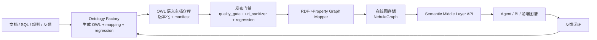

# OWL + 在线图存储落地方案 v0.1

最后更新：2026-04-17

## 1. 目标

- OWL 作为语义真相源（治理、版本、可追溯）
- 在线图存储（NebulaGraph）作为查询与展示运行时
- 发布链路可灰度、可回滚、可观测

## 2. 分层架构



## 3. 关键约束

1. OWL 不直接承载在线查询流量。
2. 在线图主键稳定（`entity_id` 不随展示名变化）。
3. 非白名单外链 URI 不得进入实体主键。
4. 发布必须绑定 `manifest_version`。

## 4. 映射规范（v0.1）

### 4.1 节点

- `owl:Class` -> `Node(labels=["Class"])`
- `owl:ObjectProperty` / `owl:DatatypeProperty` -> `Node(labels=["Property"])`
- `owl:NamedIndividual` -> `Node(labels=["Individual"])`
- XSD range -> `Node(labels=["Datatype"])`
- 字面量 -> `Node(labels=["Literal"])`

基础属性：
- `id`: 由 IRI 片段 slug 化
- `properties.iri`: 原始 IRI
- `properties.name`: IRI fragment / path basename
- `properties.kind`: Class / Property / Individual / ...

### 4.2 边

- `rdfs:subClassOf` -> `subClassOf`
- property `rdfs:domain` -> `domain`
- property `rdfs:range` -> `range`
- individual `rdf:type` -> `instanceOf`
- individual 属性断言 -> `{predicate_local_name}`

## 5. 迁移路线图

### Phase 0（1-2 周）语义冻结

- 固化 URI 白名单策略
- 固化映射规范 v0.1
- 选 20 条关键查询作为回归集

### Phase 1（2-3 周）全量导入

- 跑一次 `publish_ontology_to_graph --dry-run`
- 全量导入 NebulaGraph
- 对齐查询结果与语义口径

### Phase 2（3-4 周）增量发布

- 版本化发布（manifest 驱动）
- 失败自动回滚上个图版本
- 发布前后回归门禁

### Phase 3（持续）生产化

- 建立 SLO：导入时延、查询 P95、失败率
- 增加审批与冲突仲裁流程
- 扩展全文/向量检索（不替代 OWL 主档）

## 6. 已实现工具（本仓库）

- `tools/ontology_factory/ontology_uri_sanitizer.py`
- `tools/ontology_factory/rdf_to_property_graph_mapper.py`
- `tools/ontology_factory/publish_ontology_to_graph.py`

## 7. 常用命令

### 7.1 URI 污染检查

```bash
.venv/bin/python tools/ontology_factory/ontology_uri_sanitizer.py \
  --owl-dir ontologies \
  --strict \
  --report-json logs/ontology_factory/uri_sanitize_report.json
```

### 7.2 OWL -> 属性图 JSON

```bash
.venv/bin/python tools/ontology_factory/rdf_to_property_graph_mapper.py \
  --owl-file ontologies/TEST_DATA_xxx_ontology.owl \
  --out-nodes data/graph/xxx_nodes.json \
  --out-edges data/graph/xxx_edges.json
```

### 7.3 发布到在线图存储（先 dry-run）

```bash
.venv/bin/python tools/ontology_factory/publish_ontology_to_graph.py \
  --owl-file ontologies/TEST_DATA_xxx_ontology.owl \
  --backend nebula \
  --dataset xxx \
  --nebula-space aof_default \
  --dry-run
```

