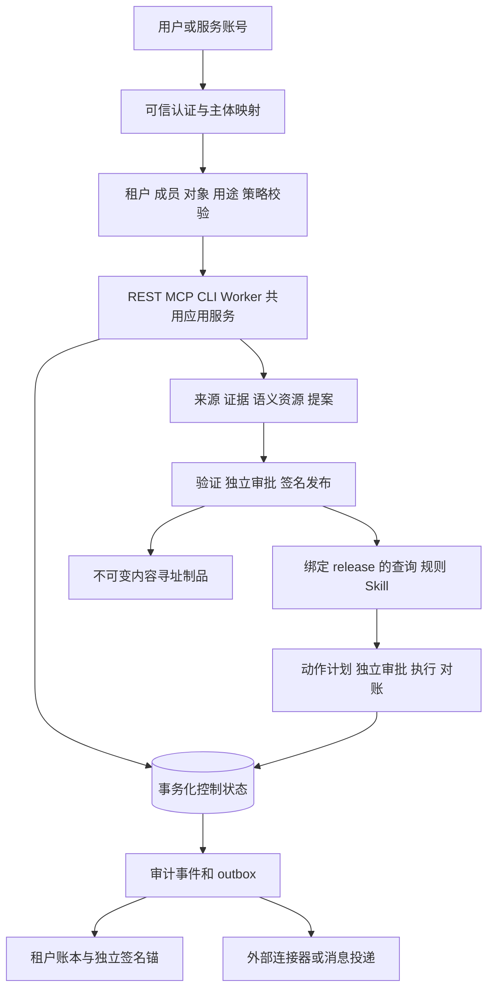

# AOF 全部已知问题修复与实施方案

> **实施状态（2026-09-07 更新）**：本方案 v1.0 为验收合同，正文保持编制时原样。
> 全部任务的实时状态、实现提交与证据见 [closure-register.json](closure-register.json)（机器可读，持续更新）。
> 已知里程碑：PR #6 已将 38 个修复提交合入 main（CI 5 项必需检查全绿）；owner 已签核
> cr-remediation-20260905；仓库已转 public 且 required checks（closure-gate 等 5 项）已配置。

版本：v1.0，2026-09-05。状态：**方案已编制，尚未实施**。

诊断基线：[2026-09-05 完整诊断](../../diagnostics/2026-09-05/README.md)，代码提交 `bfc1e02d799c5810fef25b3ee10c9445d7e52f12`。实施启动时必须再次核实 main 与分支状态；本方案没有切换当前脏工作目录，也没有执行修复、合并、部署或对外操作。

配套交付物：

- [80 项实施任务与验收台账](execution-backlog.md)：按 14 个工作包安排责任、依赖与验收。
- [机器可读关闭登记表](closure-register.json)：记录每个任务状态、提交、测试、证据、复核人；目前全部 `not_started`。

## 1. 目标及“全部修复”的严格定义

### 1.1 要解决的产品问题

AOF 已能完成来源证据到签名知识发布，再到受控查询、独立审批、动作与回执的纵向链路，但产品外围存在未鉴权入口、非事务账本、分支能力缺失、假成功持久化和不可验证部署。结果是核心用例通过，企业使用者仍无法确信：调用的是完整版本、访问的是有权查看的数据、审批和审计不会丢失、重启后状态仍一致。

本方案将 AOF 收敛为一个**可安装、可升级、可授权、可审计、可恢复，并完成真实财务业务验收的受治理运行时**。保留已实现的语义合同、发布状态机和动作治理；围绕它们补齐身份、数据、能力交付和运行条件。ERP 继续是正式业务账源，AOF 保存操作意图、执行记录与证据，不另造一套替代账簿。

### 1.2 必须同时满足的完成条件

1. D01–D12 的所有子问题都有实际修复，不仅是高优先级问题。
2. 诊断正文已经指出但未单独编号的能力缺口也进入范围，按 K01–K04 管理。
3. 在实施、迁移、测试、真实集成或验收期间新发现的问题，登记为新编号，纳入同一关闭门禁。
4. 80 项初始任务及新增任务全部有固定版本的实现、通过证据、复核结论；`blocked/deferred/skipped/waived/risk_accepted` 都不能计为关闭。
5. 同一个候选发布版本同时通过本地参考、生产单实例、生产多副本、外部集成及真实业务验收矩阵。
6. 文档、前端、后端、数据库 schema、依赖锁、策略和镜像都对应该版本，并从 main 可构建和追溯。
7. 数据迁移、生产切换、回滚、备份恢复和运行交接实际演练完成。

**方案本身不能保证不存在未知缺陷；它保证的是“全部已登记的已知问题未关闭，就不能宣称整体完成”的实施和验收机制。** 不能通过减少测试、删除产品能力、隐藏报错、把 500 改成永久 503、改低阈值或改文档措辞来满足本目标。

### 1.3 临时防护与最终修复分开记账

实施期间可以隔离危险旧入口、限制为单实例、禁用未实现能力。这些措施记录为 `mitigated`，用于防止继续扩大风险。最终仍需恢复本方案列出的产品能力并通过验收。

已明确退役的裸 `/v1/semantic/compile` 是例外：它保持 410，通过受治理 query 替代原业务需求；无需重新开放无授权的 SQL 生成。这是既定合同演进，不是临时删功能。

不要求接入世界上所有数据库、模型和 ERP。要求把**当前已声明支持的实现、恢复后的能力清单，以及本项目选定的实际企业连接器**完整验收。W00 必须冻结它们的精确清单；不得在后期为了绿灯缩小清单。企业供应商未知时可先开发 SPI 和本地测试，但真实集成任务保持未关闭。

## 2. 范围映射：没有遗漏的关闭责任

| 问题 | 必须修复的范围 | 主工作包 | 最终证据 |
|---|---|---|---|
| D01 | 决策及其余旧入口、REST/MCP/SDK/任务身份、租户和对象权限 | W01、W04、W06 | 匿名、跨租户、伪造身份、撤权对抗矩阵 |
| D02 | 并发哈希链、读时完整性、历史迁移、动作/审计一致性 | W02、W09 | 竞态、篡改、截断、崩溃、恢复报告 |
| D03 | main/internal 归并、10 个缺失导入、Context、前端、Harness/训练/导出 | W00、W03 | 每项公开能力可执行且对应当前版本 |
| D04 | production 配置、探针、持久化、多副本、密钥、升级回滚 | W02、W08、W09 | Compose 和真实 K8s 部署及恢复演练 |
| D05 | .env/私有数据进入 context、镜像与构建产物 | W07 | 所有镜像层、构建上下文、产物哨兵检查 |
| D06 | 用户/角色/租户 CRUD、唯一性、状态、配额、可信签发方 | W04 | 实际数据库重启读回、撤权、唯一性与故障测试 |
| D07 | mypy、CI软失败、空CR、路由空测试、分支门禁 | W11 | 全矩阵实跑、失败注入、required check 配置 |
| D08 | DB/文件审计、MQ、报表/异常检测、Cognee及其他空适配器 | W05 | 真实后端合同测试，无成功空实现 |
| D09 | session ACL、memory/run/replay、脱敏、保留/删除/冻结/备份 | W06 | 同租户隔离、数据生命周期与恢复不复活测试 |
| D10 | 锁定依赖、Cognee闭包、解析器、模型和外部服务 | W07、W05、W10 | fresh install、镜像及全部启用集成零skip |
| D11 | 连接/线程/子进程、指标基数、全文件读取、负载SLO | W02、W09 | 24h浸泡、容量、故障与资源曲线 |
| D12 | 文档、API、前端、License、生产手册和制品一致性 | W03、W12 | 从文档复验、能力矩阵、来源许可与发布包 |
| K01 | 第二套 SemanticFact/Release 原型与规范合同混淆 | W00、W12 | 唯一规范合同与明确迁移/适配证明 |
| K02 | 默认LLM fallback、Embedding/外部图向量、受限规划未完整接通 | W10 | 真调用、受控重规划、领域holdout评估 |
| K03 | 合成财务样本尚未替换真实业务、无业务/价值确认 | W10、W13 | 企业数据核对、动作回执、业务签字与结果账 |
| K04 | 多节点共享状态、HA/KMS/容量/异地恢复未实证 | W02、W08、W09 | 多副本、密钥轮换、故障切换、灾备回执 |

K01–K04 来自既有诊断中的架构/能力/未覆盖事项，不表示本次新发现了四个已复现故障。

## 3. 目标设计与不可破坏的约束

### 3.1 运行链路

核心约束：任何读取必须校验当前授权，任何业务动作必须绑定已批准的计划/发布，任何成功状态必须有持久回执或可恢复的事务证据。请求体、模型输出、网页参数和后台任务旧快照都不具有独立授权效力。

### 3.2 两类受支持运行配置

| 配置 | 控制面存储 | 用途与约束 |
|---|---|---|
| `reference-local` | SQLite，本机磁盘，单宿主；保留本地 RDF/SQLite 查询执行 | 开发、合同测试、演示；不是多节点HA |
| `enterprise` | PostgreSQL + 共享不可变制品存储 + 选定 IdP/KMS/MQ/业务后端 | 生产单实例及多实例，所有权威状态共享并可恢复 |

不把 SQLite WAL 放到跨机器共享目录供多个 Pod 直接写。SQLite 官方要求 WAL 使用者在同一宿主，网络文件系统不支持该方式。[SQLite WAL 文档](https://www.sqlite.org/wal.html)

PostgreSQL 用于 AOF 控制状态，不意味着必须把 RDF 语义源、ERP 数据或所有检索系统迁入同一个库。外部图/向量属于同 release 投影；业务数据库使用只读受限账号。所有启用配置都必须经过真实验证，单机通过不能替代 enterprise 通过。

### 3.3 代码组织原则

保留 `models.py`、`releases.py`、Query/Action/Workflow 等已有领域合同，按业务服务边界逐步拆出 routers 与依赖注入。`app.py` 最终只承担应用工厂、生命周期、公共中间件和路由装配；MCP 同样只负责协议和可信调用上下文。以职责和调用依赖验收，不以强行压缩行数验收。

建议新增/收敛位置（均为拟议路径，非声称已存在）：

| 位置 | 职责 |
|---|---|
| `bridge/access/` | PrincipalContext、membership、object ACL、purpose、撤权与授权决策 |
| `bridge/persistence/` | UnitOfWork、Repository SPI、SQLite/PostgreSQL、迁移版本 |
| `bridge/audit/` | 请求审计、事件查询、outbox、报表；不替代决策语义 |
| `bridge/decision_provenance.py` | 保留兼容外观，内部调用事务账本、验证器和锚定 |
| `services/semantic_middle_layer_api/routers/` | 按领域注册 REST，不在端点重复实现授权/业务 |
| `config/capabilities/` | 操作/能力/profile 注册表与必需外部依赖 |
| `tools/acceptance/` | 复验、环境清单、部署与关闭证据收集 |
| `docs/adr/` | 合同收敛、账本迁移、身份边界、HA与删除策略决定 |

## 4. W00：基线冻结与安全归并

### 4.1 实施步骤

1. 只读记录当前 HEAD、远端 main/internal、各 worktree、未提交文件清单与摘要。实际实施在 main 的独立 checkout/工作树，分支按 `codex/` 命名；不 stash/reset/clean 原目录。
2. 对 internal 与 main 做功能差异分析，检查 ancestry 与等价补丁。按能力迁移源码、测试、依赖和契约，不整体合并历史。
3. 将诊断脚本改成使用 `tmp_path` 和真实应用服务的回归测试。先记录失败，再实施修复；现有测试结果作为参考，不能按“389 个”硬锁数量。
4. 输出 `capability-manifest`：能力ID、入口、实现、数据归属、权限、依赖、profile、测试、迁移路径、owner。REST每个method/path和MCP每个tool均需一条可追踪记录。
5. 收敛第二套 `SemanticFact/Release`：逐项将其 source/evidence/proposal 语义映射到规范资源；确无正式消费者的原型移出运行时可导入命名空间并保留历史说明。存在数据/消费者必须提供转换器，不能直接删文件。
6. 绑定实际责任人和外部验收环境，冻结本方案第17节的外部输入。

### 4.2 关闭条件

D01–D12/K01–K04全部有任务映射；每个缺失模块都有恢复PR；所有未知或新发现问题有登记项。原工作区摘要不变。此步骤不会因为“分支太复杂”删掉 Context Exchange 或前端范围。

## 5. W01/W04：统一身份、授权与真实 IAM

### 5.1 身份接入

企业交互登录使用选定 OIDC IdP；服务账号使用可撤销凭据或工作负载身份。校验签发方、受众、有效期、签名算法白名单、key id及主体状态。浏览器与 Agent 不获得 `AOF_SEMANTIC_IDENTITY_SECRET`，也不允许自选角色后让服务代签。

保留现有签名 Principal 的服务间兼容适配，但签发职责移到受信任边界；不能以“任何持共享密钥的客户端”为企业普通用户。旧 HMAC 模式只在显式支持的受控服务间配置内使用，生产配置声明签发方、有效期、撤销和轮换规则。

`PrincipalContext` 至少包含 `subject_id / tenant_id / credential_id / membership_version / auth_time / effective_roles`。body里的 actor/tenant兼容字段若保留，只做一致性校验或忽略，不用于授权。tenant由服务器验证的membership选择；对多个tenant的用户，选择tenant本身仍须授权。

### 5.2 默认拒绝的操作矩阵

建立操作注册表：`operation_id, action, resource_type, required_policy, public, profile, purpose_rule`。应用启动时发现未分类操作直接失败；测试比对实际注册路由/工具与清单。

| 操作类别 | 最低规则 |
|---|---|
| 决策写入 | 有效服务/用户主体、写权限、有效tenant；不允许伪造系统发布者；证据/父决策必须在可见范围 |
| 决策读取/先例/因果链/影响/导出 | 当前tenant与对象权限；分页/计数/错误响应均不能泄露隐藏记录 |
| 提案/审批/发布 | 保持独立职责，身份有效；重新校验当前policy与release |
| 动作执行/补偿/对账 | 执行角色、原批准计划、最新撤权、幂等键；不允许通过回放绕过审批 |
| 历史build、metadata、parse、training、graph等 | 统一认证；文件白名单、URL/S3/DB配置由可信配置给出；所有资源限租户/用途 |
| ops/metrics/下载 | ops受管理授权或内部网络策略；只有最小存活探针允许匿名 |
| CLI/MCP/worker | 同一应用服务授权；本地管理员模式单独命名，不能隐式用于共享服务 |

401表示未认证，403表示已认证但无权限；隐藏对象按一致策略404，避免存在性泄露。新端点必须测试常规通过、匿名、错误tenant、错误角色、对象ACL、过期凭据、撤权、超预算等路径。

### 5.3 IAM持久化设计

当前 `SQLAlchemyRBACAdapter` 已有部分用户写读实现，可复用并补齐，不另建一套平行模型。通过显式 Repository 注入替换 `RBACManager/TenantManager` 的 pass；未提供仓库的构造不能返回成功。SQLite参考和PostgreSQL生产运行同一领域合同测试。

建议实体：`users, tenants, memberships, roles, permissions, role_assignments, service_credentials, revocations, quota_reservations`。唯一性在数据库落实，至少覆盖tenant slug、外部issuer/subject映射、membership和role assignment。

租户建立为 `provisioning → active`；只有必需资源成功建立才能active。外部资源建立失败使用可追溯补偿，不能仅改变一个内存字段。暂停/删除后即刻拒绝新请求，待执行任务重新检查；恢复备份不得让已撤销凭据重新有效。

配额来源于实际仓库统计和事务预留。并发创建资源必须先预留，失败归还；定期对账修复统计偏差。禁止可预测临时密码、默认Nebula root凭据进入生产配置；外部图库管理账号从受控凭据提供器获取。

### 5.4 验收

原匿名决策probe变为拒绝；合法主体完成record/search/export；跨tenant父链和计数不泄露。用户/租户跨进程、跨实例重读；并发同slug只有一个成功；权限撤销后下一次动作执行不成功。管理员界面能实际完成成员、角色、暂停与凭据撤销操作。

## 6. W02：事务账本、审计完整性与动作一致性

### 6.1 存储合同

新增账本Repository，保持 `DecisionRecord/EvidenceRef` 对外语义。核心表建议：

- `decision_entries(tenant_id, sequence, decision_id, payload_digest, previous_hash, entry_hash, payload_ref, recorded_at, schema_version)`。
- `ledger_heads(tenant_id, sequence, head_hash, checkpoint_id)`。
- `decision_parents(tenant_id, decision_id, parent_decision_id)`，同tenant外键约束。
- `outbox(tenant_id, event_id, aggregate_id, version, payload_ref, status, retry_at)`。
- `ledger_checkpoints(tenant_id, sequence, head_hash, key_id, signature, external_receipt)`。

`(tenant_id, sequence)`、`(tenant_id, decision_id)`及业务幂等身份建立唯一约束。独立租户链避免正常租户间形成隐式因果关系；历史跨租户引用先隔离审查，不自动搬入。

### 6.2 写入和读时校验

一次追加事务内：验证请求权限→校验父记录→锁定链头→检查幂等→计算规范payload hash→插入entry→更新链头→提交。PostgreSQL使用行锁/冲突重试；SQLite参考使用明确写事务和busy timeout。锁序固定，重试预算有界，数据库错误不包装为成功。行锁原语依据[PostgreSQL文档](https://www.postgresql.org/docs/current/explicit-locking.html)。

所有正常读取都通过验证仓库，不直接JSON加载。对返回entry验证payload hash和链/分段证明；against可信checkpoint验证尾部及必要祖先区间。分页、计数、先例索引也需要事务版本与校验水位，不能只校验最终命中的一条而接受已截断账本。

写入不再全文件扫描。维护有边界的增量验证水位、分段摘要或等价结构；首次打开/迁移做全链验证，正常读取校验所依赖的完整性证明，周期全量校验发现问题立即隔离。仅缓存“曾经校验成功”的布尔值不合格。

### 6.3 独立锚定的威胁边界

普通数据库hash能发现意外损坏，不能防止拥有写库权限的人重算整条链。企业profile将链头/序号按策略签名并写到独立凭据保护的不可变存储；锚定对象与普通业务DB管理员权限分离，签名密钥由KMS保护。

规定锚定延迟与高风险动作要求：高风险动作执行前对应批准事件须取得独立锚回执；普通查询可按固定小批量锚定，但未锚窗口必须显式可见。不能声称锚定间隔内或KMS管理员也被完全攻破时仍绝对不可篡改。

### 6.4 业务事件与外部副作用

本地状态变化和审计/outbox写入同一UnitOfWork。不能先写一个SQLite库，再写JSONL，然后两边都宣称事务完成。需要共享的权威状态统一PostgreSQL事务；参考环境同一SQLite数据库内完成相关写入。

外部ERP/MQ无法用本地数据库事务实现“绝对exactly-once”。采用事务outbox、稳定幂等键、connector回执查询、消费者inbox去重、状态版本比较。外部结果未知进入 `reconciliation_required`，不盲目重试；补偿是新的受授权动作，保存原始回执。

### 6.5 历史迁移

先备份原JSONL，保留文件摘要、顺序和原hash；dry-run校验缺租户、重复ID、损坏、未知parent。有效记录导入并保留legacy identity，不重新签名伪装原记录从来可信。无可信tenant归属的记录进受限隔离区，由责任人映射并留下迁移决策。

旧账本封存，停止旧writer后切换；迁移清单记录输入行数、有效/隔离/重复数、tenant映射、输出摘要及回滚点。所有异常记录最终需要明确处置证据，否则迁移任务不关闭。不要为让迁移通过直接删除历史坏行。

### 6.6 必测故障

8进程×1000条同tenant竞争；跨tenant并发；相同idempotency key不同payload；断电模拟/kill位于commit前后；尾部截断、中间删除、重排、payload替换、重算hash但锚不一致；DB只读/磁盘满；外部成功但客户端timeout；恢复后重新投递。要求有效链、无未解释缺口、无重复业务写，未知状态保持对账。

## 7. W03：完整恢复 internal 能力、Context 与前端

### 7.1 归并内容

不能只修最先返回500的两个接口。以下全部进入恢复范围：

| 能力组 | 恢复内容 | 治理适配 |
|---|---|---|
| Harness | session、iteration、attribution、export及原测试 | 真实持久化、session ACL、敏感轨迹和用途控制 |
| 训练数据 | pipeline、models、quality、SFT/RAG/agent/raw generators | 来源授权、最小披露、去重、版本、评估/训练隔离 |
| OKF/RAG/Markdown | service、exporter、索引、查询及MCP工具 | 发布和tenant/resource范围，不旁路知识治理 |
| graph/hybrid/doctor | 检索、融合、健康/诊断、graph retrieval | 后端合同、同release、错误分类 |
| Context Exchange | contracts/gateway/exporter/submission/promotion/public/tenant policy | private→quarantine→独立审批→release→受限消费 |
| web |源码、依赖锁、API client、认证、审批/运行/对账视图 | 前后端同合同；无浏览器端特权凭据 |

AST缺失导入扫描是第一道检查；之后每项必须真实调用，而不是把import挪到更深处。全量REST、MCP、SDK与CLI测试使用真实应用服务，外部后端由独立集成profile提供。

### 7.2 Context Exchange不能绕过审批

producer只提交显式选择的assertion、source ref或脱敏摘录及摘要；不直接拷贝个人vault、原始会话或私有关系。可信服务注入tenant/actor/purpose，检查来源策略与consent有效期；接收成功只表示quarantined，不表示可查询的企业知识。

补齐版本化策略API与管理员UI。客户端策略缓存过期时按更保守行为拒绝共享，不能默认允许。发布由不同主体完成隐私/领域/发布审批；撤回需阻止未来查询/训练使用并保留必要审计。未知来源默认private；历史已合入internal的实现和测试作为迁移输入，不能直接继承“已通过”的结论。

### 7.3 前端验收流程

干净克隆→锁定安装→typecheck/build→生产镜像托管→浏览器登录→选择有权tenant→查看证据→提交提案→不同角色审批→查询→动作批准→执行→对账/审计→登出及撤权。

增加同tenant另一用户打不开private session、深链接不绕权、按钮失败不显示成功、断线后从服务重读状态的E2E。session cookie/CSRF或bearer方案按选定认证实现一致设计；不允许前端自行拼造可信身份headers。

## 8. W05：适配器、请求审计、报表和异常检测补齐

### 8.1 审计存储和查询

将AuditLogger数据库函数接到Repository，确认commit后才计入durable成功计数。文件模式提供实际按ID/时间/主体/资源检索、稳定分页、timezone规范和边界检查；DB查询使用绑定参数。请求审计与DecisionProvenance分别保存，但使用correlation_id连接。

实现当前声明的JSON/CSV/HTML/PDF报告，输出来自真实查询；HTML转义、CSV公式防护、下载权限和过期链接需测试。异常检测先交付确定性规则：时间窗失败率、登录/访问异常、权限拒绝突增、outbox积压等，保存规则版本、阈值、证据事件和告警回执，不把规则告警称为因果证明。

### 8.2 MQ与其他后端

生产MQ使用事务outbox→真实broker→inbox去重；启用的各broker插件均要有独立测试，不能用抽象接口通过替代实际投递。发送函数不得为空却返回成功；故障时durable outbox保留待投递状态，告警可见。

Cognee当前查询/清理TODO逐个实现；增加dataset/tenant范围、分页、读后验证、受控删除和异常语义。盘点所有产品声明的其他后端，包括URL/S3/schema extraction/增量同步/缓存/调度，完成每项实际backend合同。缺少依赖可在开发profile明确未启用，但enterprise必需能力必须接通后才关闭。

URL/文件/DB类入口延续白名单与最小凭据，检验重定向、解析路径逃逸、超大文档、缓存污染、参数注入等负例。不得读取开发机真实秘密作为测试输入。

## 9. W06：会话权限、保留删除与审计协调

### 9.1 数据模型与授权

新增Session实体：`tenant_id, session_id, owner_subject, visibility, business_object_id, acl_version, retention_policy_id, state`。visibility为private/team/business-object；默认private。新增ACL条目绑定subject/group与read/write/share权限；group membership由可信目录取得。

run、memory、summary、citation、replay、export和后台操作都引用Session/业务对象访问范围。缓存key必须含tenant、对象和授权版本；检索必须在返回内容前执行权限过滤，而不是只在页面隐藏。

旧session不能自动分配给“当前读到它的人”。迁移依据可信run requester映射owner；无法判定的session进入受限迁移队列。历史广泛共享需要明确迁移决定和回执。

### 9.2 删除与不可变账本

划分不可变最小审计信封与可删除的敏感payload：账本保存事件类型、主体引用、时间、摘要、动作和处置证明；原文/问题/摘要/证据敏感字段放入受控加密payload store。若摘要本身可能泄露敏感低熵值，采用适当的带密钥摘要或其他最小化表示，不能假定hash天然匿名。

删除流程：检查legal hold/保留策略→立即撤销读取→记录tombstone→删除派生索引/缓存/训练候选→处理payload和密钥→生成删除回执。审计链不通过原地改写假装保持完整。合法冻结与删除请求冲突时显式记为待处置，不能静默保留还报告已删除。

备份恢复前合并独立保存的删除日志、撤权epoch及密钥状态，防止旧备份复活数据。备份保留与密钥销毁策略须实测；不能只删除在线表。

## 10. W07：依赖、构建上下文与发布制品

采用单一依赖声明入口，锁定Python版本、运行profile、传递依赖与平台条件；前端锁文件一并冻结。开发requirements与服务requirements从同一来源导出或改为一致安装入口。

Cognee先做当前适配器兼容矩阵，再确定可安装release或可复现fork提交；不猜`0.1.45`与本机修改版等价。锁定文档解析器和外部SDK，明确wheel/sdist及native系统依赖。CLI入口须在没有源码目录的安装环境运行。

构建使用最小白名单COPY；`.dockerignore/.gitignore`覆盖`.env/.env.*`、私有数据、临时目录和开发配置，允许明确无秘密的example。检查最终文件系统及所有镜像层，防止“后续RUN删除”掩盖前一层秘密。Docker的context/ignore作用范围参见[官方文档](https://docs.docker.com/build/concepts/context/)。

fresh install必须从空cache、无本地.pth、无editable安装环境执行；本次诊断的分发包复制方式不能作为该关卡证据。SBOM、依赖来源、镜像digest、许可证、漏洞扫描与release绑定；不可用依赖由capability/readiness显式说明。

## 11. W08：生产运行、共享状态、升级与回滚

### 11.1 统一生产配置

配置schema包含runtime mode、数据库、artifact store、IdP/凭据提供器、三类签名域、SLO、OTel、必需backend、payload/备份位置、privacy policy和profile。生产启动器强制production，缺项不可降为development；不能仅根据文件名判定环境。

健康分离：`/healthz`检查进程基本存活；`/readyz`检查schema版本、核心DB、账本健康、必要凭据和启用backend是否具备服务条件；已有readiness端点可兼容转接。下游暂时不可用导致unready与告警，不应造成所有Pod持续重启。探针不得泄露密钥/内部业务信息。

### 11.2 必须迁移的权威状态

enterprise profile需要覆盖全部状态，不只把审计或session换成PostgreSQL：

- IAM/membership/ACL/revocation/quota。
- source/cursor/change log/ingestion run/worker lease。
- proposal/waiver/approval/resource revision/release manifest。
- compilation run/channel pointer/promotion/rollback。
- query plan/query receipt/evidence index。
- action plan/action run/approval/idempotency/reconciliation。
- workflow DAG/node state/claim/compensation。
- Agentic run/session/memory/replay receipt。
- decision ledger/request audit/outbox/inbox/checkpoint/deletion log。
- Harness/训练任务/Context queue和发布关联。

共享制品存储用内容寻址和签名验证，DB指向不可变digest。上传成功但DB未提交的对象由可审计GC回收；DB引用不存在制品时失败关闭。promotion指针与资源状态使用事务比较版本，避免不同Pod看到未完成发布。

### 11.3 多副本与任务执行

先跑单实例持久卷正负路径，再运行至少三个API副本、两个worker，并将请求刻意路由到不同节点。worker使用有租约的claim、版本CAS/fencing token；失联worker恢复后不能以旧租约提交副作用。外部系统不支持fencing时仍需幂等键与查回执/对账，不能承诺完全消除所有不确定性。

KMS轮换测试包括新key签名、旧key验证历史、未知/撤销key拒绝、KMS不可用时新高风险动作阻断。TLS/网关认证和内部服务身份实接。redis等缓存不能成为授权或状态唯一来源。

### 11.4 数据迁移和上线

按expand→backfill→validate→switch→contract执行；每步有检查点、行数/摘要/引用校验和恢复命令。迁移可重入，版本不匹配拒绝运行。重大状态迁移先停写/冻结动作并取得备份，不在旧版与新版同时无控制地双写。

发布次序：冻结候选SHA→构建签名制品→测试环境迁移→完整验收→生产备份→canary只读→小范围受审批动作→放量。canary阈值使用第13节冻结的SLO，审计损坏/跨租户访问/重复动作任一发生立即冻结动作与切流。

回滚优先回到schema兼容的上一镜像；不可逆schema不自动降级，使用修复前推或经过验证的恢复流程。恢复数据库之前必须确认外部动作已发生的事实，恢复后保留未决对账和幂等记录，不让旧备份重新执行已完成动作。

## 12. W11：CI、类型检查与真正不可绕过的关闭门禁

### 12.1 代码与测试门禁

修复mypy模块命名重复、缺内部模块、stub和实际类型错误；选定明确包边界。要求受支持生产代码整体零错误，不把整个文件排除，不用无边界Any/type-ignore作为消音器。允许少数外部无stub SDK用局部typed adapter包装并登记，不能因此跳过整个集成。

建议固定required jobs：`lint-type`、`unit-contract`、`auth-adversarial`、`storage-migration`、`api-mcp-cli`、`web-e2e`、`fresh-install`、`image-security`、`compose-smoke`、`k8s-integration`、`provider-integration`、`closure-gate`。长时性能/DR在release候选上运行并提供绑定SHA的必需证据，不能用旧版结果替代。

GitHub的required检查可能接受skipped/neutral，因此增加always运行的汇总gate，验证job清单、真实success、无缺失以及profile预期；不只依赖平台展示绿灯。[GitHub required checks说明](https://docs.github.com/en/pull-requests/how-tos/merge-and-close-pull-requests/troubleshooting-required-status-checks)

### 12.2 CR与产品release分开

CR gate必须读取版本化期望清单。配置缺失、来源目录意外缺失、审批记录不完整一律失败。确无变更时生成可校验的`no_changes`记录，绑定commit比较范围；不能靠创建空目录通过。

源码PR可以分批合入，但“全部关闭”的release gate在所有任务完成前持续失败。这避免为了实施早期PR而把最终验收规则降级。全量测试、语义发布审批和产品关闭登记分别表达不同事实。

### 12.3 关闭证据结构

每个任务至少填写：实现commit、test IDs、环境profile、制品digest、运行时间、命令/退出码、测试输出摘要、独立复核人、结论。证据保存在受访问控制的制品库，公开报告不包含客户原文或凭据。

`closure-register.json` 当前是方案台账，验收验证器属于W11待实现。验证器需要检查：编号唯一、发现覆盖完整、依赖已满足、必需证据存在且摘要正确、每项状态closed、复核人与实现负责人分离、SHA/镜像匹配。新增问题自动阻断最终gate。

临时fail-closed、未配置可选能力、开发profile skip 都有各自状态，不能被汇总为enterprise profile成功。

## 13. 验收测试矩阵与量化标准

下列数字是**本方案提出的初始验收目标，不是当前性能测量**。W00根据实际数据量与设备冻结更具体的合同；目标如需变更，必须在测试前形成有业务理由的版本化决定，不能失败后临时降标。

| 维度 | 必测场景 | 通过标准 |
|---|---|---|
| 功能完整 | 所有注册REST/MCP/CLI/UI及恢复模块 | 清单100%有功能或安全拒绝测试；必需启用能力实际成功；内部缺失导入0 |
| 身份和隔离 | anonymous/tenant/subject/ACL/purpose/role/revocation | 未授权读取、写入、计数泄露、越权审批为0 |
| 审计并发 | 8进程×1000条、同key竞争、跨tenant | 无断链/重复ID；成功提交无审计丢失 |
| 损坏与恢复 | 改写/删除/截断/重算/kill/磁盘满 | 有效拒绝/隔离；无伪成功；修复/恢复回执完整 |
| 类型/质量 | 完整受支持代码 | Ruff、mypy错误0；没有||true等软失败 |
| 覆盖率 | 行+分支、新增安全/持久化模块 | 全支持代码行≥80%、分支≥70%；安全/账本新增改动行≥90%、分支≥85%；对抗矩阵100% |
| 参考后端 | SQLite/RDF本地 | 全合同通过；不计为enterprise集成替代 |
| 真实集成 | 冻结的IdP/KMS/MQ/SQL/Cognee/模型/图向量/业务连接器 | enterprise必需集成零skip；失败行为正确 |
| UI | 登录→证据→审批→执行→对账及权限负例 | 真实浏览器生产构建通过；无客户端授权旁路 |
| 资源生命周期 | 24h浸泡、cancel、异常重试 | 无新增ResourceWarning；连接/FD回到预算范围，不随完成请求数单调增长 |
| 指标基数 | 100000随机path/object id | 指标series按路由模板和固定维度有界 |
| 基础性能 | 4vCPU/8GiB应用、独立DB，100万事件/1万语义资源、50并发、30分钟 | 不含LLM调用的普通API p95≤1s；本地确定性查询p95≤3s；非预期5xx<0.1%；队列不持续增长 |
| 浸泡内存 | 热身1h后相同工作负载24h | RSS在冻结预算内，末时段相对稳定基线增长≤10%；先排除缓存预热因素 |
| 多副本 | 三API两worker跨节点、实例/worker退出 | 无重复业务动作；读到一致release；不确定动作进入对账 |
| 恢复 | 跨环境恢复、密钥/删除日志/回执 | 初始目标RPO≤5min、RTO≤60min；已确认动作不得因恢复重复 |
| 依赖安全 | fresh install、全部镜像层 | 无真实或合成秘密哨兵；可安装闭包；无未处置可利用高危依赖 |
| 财务正确性 | 合成+经授权真实样本 | 金额按业务定义精度逐项一致、来源引用可定位、错tenant/月/区域为0 |

外部LLM latency/cost单独冻结预算，不能混入普通API p95。恢复RPO不允许解释为“可以丢掉已发生外部动作的追踪”；外部回执和幂等恢复有单独强制对账条件。

## 14. W09：资源、可观测性与故障运维

SQLite连接使用显式close的生命周期封装，异常/取消也释放；仅`with connection`负责事务而非关闭连接，参见[Python sqlite3文档](https://docs.python.org/3.13/library/sqlite3.html#how-to-use-the-connection-context-manager)。统一同步/异步Repository上下文，限制池大小和排队时间。解析子进程、文件句柄、网络session、后台线程均纳入生命周期检查。

指标改用匹配到的route template，未知路径统一桶；不把原始tenant/session/query作为无限label。结构化trace仅保留必要关联ID，敏感内容单独受控保存。加入账本验证失败、outbox延迟、lease竞争、pool saturation、撤权拒绝、动作待对账等指标。

性能工作按测量→定位→改动→同条件复验推进。固定数据集和硬件，保留原始曲线及错误分布；不以一次平均延迟报告代替容量结论。实施连接关闭和有界指标后跑24h浸泡，排除日志、缓存、线程泄露。

至少实际演练DB不可用、broker停机、KMS超时、artifact缺失、worker失联、节点退出、备份恢复。告警发到指定测试通道并确认送达，只有模板文件不算完成。正式值班交接包括排障入口、冻结动作、回滚决策人、对账操作和恢复清单。

## 15. W10：模型、知识后端与真实财务闭环

### 15.1 模型不是权限源

实现默认`llm_fallback`真实执行器，但仅输出结构化候选意图/计划/解释；后续必须经过能力allowlist、QueryPolicy、typed intent、release digest、证据及预算校验。模型不能构造任意SQL、读任意文件、添加角色或批准自己的ActionPlan。

有限动态重规划只针对明确失败原因、已发布能力和有限步数；每次保留计划版本和修改理由。执行过的动作不自动重复，未知结果停止并对账。prompt injection/恶意证据/工具回执污染负例属于必测。输出无可核验证据则拒答或返回明确待补证据状态。

### 15.2 外部Embedding和图向量

接通选定实际Embedding、图和向量服务，写入投影时保留tenant/release/resource/ACL、source ref、embedding model revision。检索范围由服务计算；发布切换和删除要同时影响投影。模型升级或向量重建生成新projection版本和验证记录，不静默改变已有release行为。

稀疏检索继续作为参考/回归基线；真实Embedding通过不表示自动更准确。使用独立holdout比较召回、引用准确性、拒答、延迟和费用，不把训练数据或Golden答案送入被评估的输入上下文。

### 15.3 企业业务验收步骤

1. 数据负责人提供一组获授权、可追溯的真实收入/预算/回款数据与合同；明确币种、精度、区域、期间、会计口径和更正版本。
2. 领域负责人标注期望数值、证据条款、应拒绝问题及需要人工判断的内容。建议至少100条经复核案例，覆盖时间/区域边界、缺失、矛盾证据、撤权与异常连接。
3. 固定release、QueryContract、policy、模型和数据快照；在真实只读SQL源执行，与人工/既有报表逐项核对。
4. 选择实际工单或ERP/CRM受控接口，只允许已批准的低风险动作类型；保存请求、幂等身份和回执。真实环境如只授权沙箱写入，先完成集成验收，生产业务关闭仍等待经授权验证。
5. 独立主体审批后执行；注入timeout、重复投递、系统中断，证明不会重复写入且未知回执进入对账。
6. 观察至少一个完整复核周期并记录用户返工、审核时间、错误和实际动作结果；业务负责人签收准确性和可用性。

价值记录采用baseline→observed→validated/realised等有证据状态，收益为零或不明确也如实记录。工程项目完成不要求捏造正ROI；若收益未证实，应明确关闭“缺少测量”的问题，而不能写“已创造收益”。

## 16. W12：文档、许可和交付一致性

以capability manifest生成API操作清单、MCP工具列表、配置profile和文档交叉检查。README叙述当前规范路径；历史章节有明确迁移链接，不能沿用51端点或把实验能力写为已验收生产能力。

交付包包含后端wheel/镜像、前端静态产物、schema迁移、依赖锁、默认最小策略、Compose/K8s配置、SBOM、数据迁移/恢复脚本、runbook和验收回执。文档中的命令从干净环境执行，不引用开发者本地绝对路径作为必需配置。

License占位由权利人作明确分发决定，不由工程师猜测开源许可。修复包含明确许可证或内部使用文件、第三方来源清单和恢复资产的许可依据；未取得决定时该项保持blocked。公开来源内容是否可训练/分发按实际来源授权处理，不能只因“公开可访问”默认允许。

## 17. 外部输入、责任与无法自行伪造的证据

这些输入不阻止先写代码、搭建合同测试和准备迁移，但会阻止对应最终验收：

| 输入 | 提供者 | 最晚需要 | 未满足状态 |
|---|---|---|---|
| 功能清单归属和首次管理员 | 项目负责人 | W00/W04 | 未绑定能力不得被悄悄删去 |
| OIDC租户、服务身份、测试账号 | 安全/IT负责人 | W01真实集成前 | identity任务未关闭 |
| 专属AOF数据库、artifact、MQ和KMS测试环境 | SRE/平台负责人 | W05/W08前 | 不借用其他项目生产容器冒充验收 |
| 选定供应商/版本及连接凭据 | 平台与集成负责人 | W00清单冻结/W05验证前 | SPI测试不能替代真连接 |
| 授权企业财务数据、口径和期望结果 | 财务/数据负责人 | W10前 | 合成样本不替代真实业务关闭 |
| 可执行工单/ERP接口及动作授权 | 业务系统负责人 | W10动作验收前 | 不开展未授权生产写入 |
| 保留期、共享范围、冻结和备份策略 | 数据/安全负责人 | W06迁移前 | 使用最保守开发默认，最终仍未关闭 |
| License/第三方资产使用决定 | 权利人/项目负责人 | W12发布前 | 不自选许可证，也不删除问题编号 |
| 生产窗口、回滚人、值班和验收签名 | 发布/业务负责人 | W13前 | 不将“代码完成”升级为“全部完成” |

所有owner_role应在W00绑定owner_person。此方案不以等待外部输入为理由停止不依赖它的实施任务，也不将等待状态计入已完成。

## 18. 实施批次、依赖与工作量

### 18.1 分批实施

| 批次 | 工作范围 | 可交付状态 |
|---|---|---|
| B0 | W00、W07启动；D01/D05临时防护；W11建立缺陷测试 | 基线冻结、危险入口被控制，尚未全部修复 |
| B1 | W01、W02、W04、W07核心 | 身份/事务/安装闭包可复验；单机安全基线 |
| B2 | W03、W05、W06；W11持续接入 | 原有能力恢复、权限/隐私/后端完整 |
| B3 | W08、W09、W11部署与负载 | enterprise单实例/多副本/恢复通过 |
| B4 | W10、W12 | 模型与真实企业业务闭环、文档制品一致 |
| B5 | W13全量重跑与签收 | 所有登记问题closed，允许声明全部已知问题关闭 |

W02存储SPI和schema约定完成后，W04可以在同一合同上实施；W01认证结构可以先用受控测试主体，但最终必须依赖真实membership校验。W11从第一批开始，不等其它功能全部做完才接CI。不同职责工作可并行开发，但同一文件/合同变更必须由负责人协调。

### 18.2 PR切分原则

建议按“回归测试+单一合同+实现+迁移+文档”做可审查纵切，例如：入口操作清单；决策租户过滤；账本SQLite事务；PostgreSQL账本；状态outbox；IAM CRUD；Context归并；前端审批；MQ查询；session ACL；锁文件/镜像；生产模板；HA；真实连接器；最终关闭验证。

每个PR必须明确影响的D/K编号、仍未关闭部分、验证profile和迁移风险。禁止通过一个大PR整体复制internal，也禁止只合测试或只写TODO就关闭问题。

### 18.3 工作量预算

这是初始排期预算，未经过团队产能标定：预计约 **160–280工程人日**，建议由后端/存储、前端、安全/身份、SRE/集成、QA五类责任共同承担。4–5名主要工程人员加业务/IT支持，通常需按 **12–20周的项目窗口**筹划；真实数据、企业接入和采购等待另计。该数字不是保证交付日期，W00结束后依据恢复代码质量和实际连接器重新估算并保留版本记录。

不得为了赶窗口省略W09/W10或把P2改成后续事项后宣称完成。若资源不足，调整窗口和人员，保持关闭范围不变。

## 19. 最终关闭、移交与审计

W13的汇总程序必须拒绝：任一任务未closed、缺外部验收、证据SHA不一致、缺独立复核、存在未处置新问题、启用能力被skip、镜像不是已测制品、数据迁移未核对或rollback未演练。

最终交付一份closure report：D/K逐项的根因、修复提交、测试、真实环境证据、迁移/回滚结果、负责人、复核人、关闭时间；附最终main SHA、镜像digest、schema/policy/model/backend版本、业务签字、运行SLO和剩余已知问题数。**剩余已知问题必须为0，不能把风险接受或待外部验证计入0。**

“未知问题为0”不作为可证明的声明。交付后建立回归和运行监测，任何新发现按缺陷流程处理；在本次最终签收前发现的缺陷必须并入本计划完成。

## 20. 方案编制依据

本方案的现状判断来自固定提交诊断和本地源码复核，不把历史internal测试成绩当成main当前事实。技术选型是为修复上述问题提出的设计，不表示已经实现。

重点源码包括：`bridge/decision_provenance.py`、`bridge/auth/rbac.py`与`db_models.py`、`bridge/tenant/manager.py`、`bridge/audit/*`、`bridge/semantic_core/action_runs.py`、`query_execution.py`、`production.py`、`agentic_system.py`、API/MCP注册和Docker/K8s模板。10个缺失导入和功能分支差异见原诊断证据。

SQLite并发边界、Python连接生命周期、PostgreSQL锁、Docker构建上下文以及GitHub检查语义已按上文链接的官方文档核对。其余目标和阈值是本方案的拟议验收合同，不应引用为现有实测能力。
